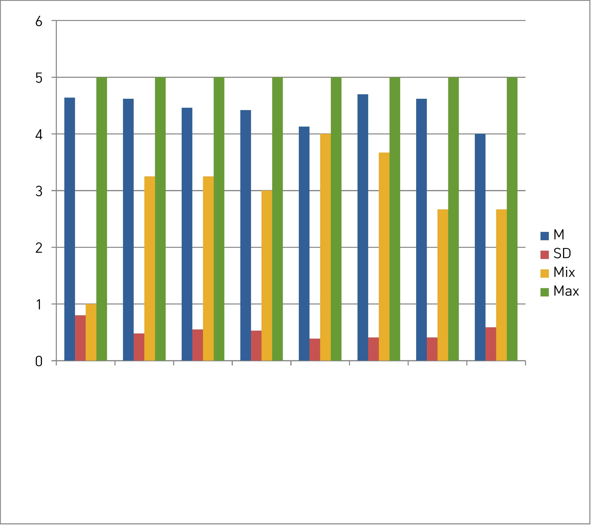
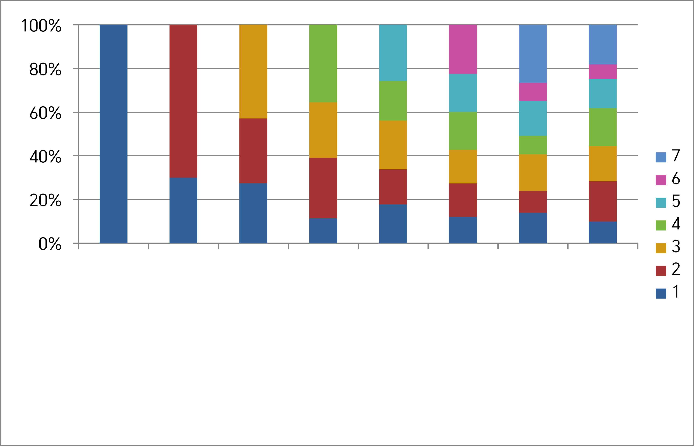

# 일곱 가지 질문에 답하다

## 학습 목표

- 축구 선교 활동이 교회 공동체에 미치는 영향을 7가지 측면에서 정리한다.
- 양적·질적 연구 결과의 통합적 해석을 이해한다.
- 본 연구가 제시한 핵심 발견을 요약할 수 있다.

&nbsp;

## 연구결과

본 장은 양적 자료와 질적 자료를 통합하여 7개 연구 질문(7*RQ*)에 대한 답을 종합한다. 먼저 주요 변수의 기술통계와 상관관계를 살피고, 그 결과를 바탕으로 일곱 영역의 결론을 정리한다.

분석에 사용된 주요 변수는 다음과 같다.

1. 축구선교 인식
2. 성도 **친밀성**
3. **봉사와 섬김도**
4. 전도/선교 접합적 기능
5. **다음 세대**를 위한 선교적 전략
6. 담임목사와의 관계
7. **신앙성숙**
8. 심리적 안정감

이 여덟 변수의 일반적 경향성과 상호 관련성을 다음 두 단계로 확인하였다.

### 1) 주요 변수의 기술통계

본 연구의 주요 변수인 축구선교 인식, 성도 친밀도, 봉사와 섬김도, 전도 및 선교의 접합적 기능, 선교적 전략, 담임목사와의 관계, 신앙성숙, 심리적 안정감의 일반적 경향성을 확인하기 위해 기술통계분석을 실시하였다.

### 2) 주요 변수 간 상관관계

본 연구의 주요 변수인 축구 선교 인식, 성도 친밀도, 봉사와 섬김도, 담임목사와의 관계 간의 관련성을 확인하기 위해 *Pearson* 적률 상관 관계 분석을 실시하였다. 분석 결과, 상관관계가 가장 낮은 변수는 담임목사와의 관계와 심리적 안정감 간의 관계였다(*r*=.17, *p*<.05).

유의수준 표기: \**p*<.05, \*\*\**p*<.001

이러한 기술통계와 상관관계 결과를 토대로, 7개 연구 질문에 대한 답이 서로 분리되지 않고 하나의 그림으로 맞물린다는 사실이 확인된다.

## 요약

본 장은 양적·질적 두 자료를 통합하여 7개 연구 질문에 대한 답을 종합한다. 축구 선교 활동은 공동체의 친밀성을 강화하고, 전도와 봉사로 이끌며, 다음 세대를 향한 통로를 열고, 담임목사와 성도 간의 관계에 긍정적 영향을 미친다. 무엇보다도 신앙의 성숙과 정서적 안정에 기여한다는 점이 인상적이다. 일곱 질문에 대한 답은 분리되지 않고 서로 맞물려 하나의 그림을 완성한다.

## 생각해볼 거리

1. 일곱 영향 중 우리 교회에서 가장 우선적으로 기대하고 싶은 것은 무엇인가?
2. 양적 자료와 질적 자료가 같은 결론을 가리키는 부분은 어디이며, 다른 부분은 어디인가?
3. 이 일곱 영향을 우리 교회의 다른 사역에서도 볼 수 있는 방법이 있을까?

## 더 읽을거리

- 이정숙 (2007). 선교 활동에 있어서 스포츠의 역할과 그 중요성. 박사학위논문, 아세아연합신학대학교 대학원.
- 홍영식 (2007). 칼빈주의에서 본 축구 선교. 신학박사논문, 고려신학교 신학원.

## 도표

{width=82%}

*그림 12-1. 주요 변수의 기술통계. 여덟 변수(축구선교 인식, 성도 친밀도, 봉사와 섬김도, 전도/선교 접합적 기능, 선교적 전략, 담임목사와의 관계, 신앙성숙, 심리적 안정감)의 평균(M)·표준편차(SD)·최솟값(Min)·최댓값(Max)을 나타낸다. 모든 변수의 평균이 5점 척도에서 4점 이상으로, 응답이 전반적으로 긍정적이었다.*

&nbsp;

{width=82%}

*그림 12-2. 주요 변수 간 상관관계. 여덟 변수 간 Pearson 적률상관의 상대적 크기를 누적 비율로 나타낸다. 상관이 가장 낮은 조합은 담임목사와의 관계와 심리적 안정감(r=.17, p<.05)이었다.*
